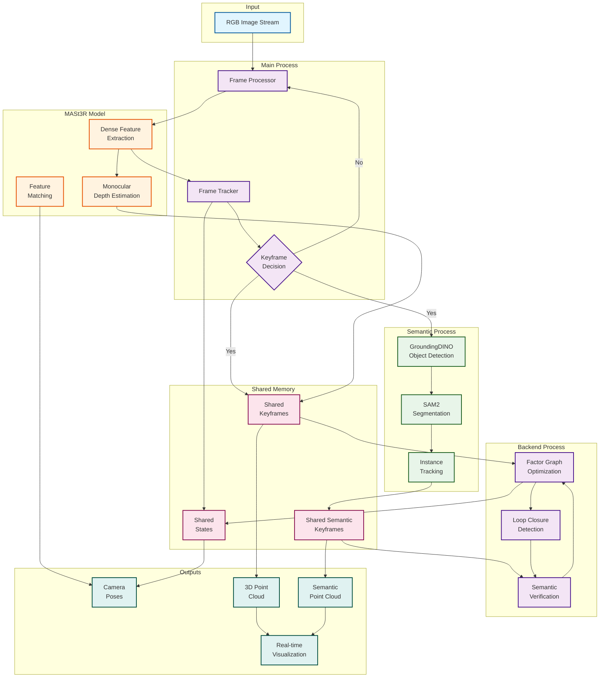

# Semantic SLAM System Flow Diagram

## High-Level Architecture



## Detailed Data Flow

### 1. Frame Processing Pipeline
```
RGB Image → Resize & Normalize → Feature Extraction → Dense Descriptors
                                                    ↓
                                              Depth Prediction
                                                    ↓
                                              3D Point Map (X,C)
```

### 2. Tracking and Keyframe Selection
```
Current Frame → Match with Recent Keyframes → Estimate Relative Pose
                                            ↓
                                     Tracking Quality Check
                                            ↓
                            [Good Tracking]     [Poor Tracking]
                                  ↓                    ↓
                            Update Pose          Relocalization
                                  ↓
                          Keyframe Criteria
                         (motion, quality)
                                  ↓
                    [New KF]            [Continue]
                        ↓                    ↓
                 Add to Keyframes      Next Frame
```

### 3. Semantic Processing Pipeline
```
Keyframe Image → GroundingDINO → Bounding Boxes + Labels
                                        ↓
                                   SAM2 Segmentation
                                        ↓
                                   Binary Masks (RLE)
                                        ↓
                                 Instance Tracking
                                        ↓
                            Semantic Keyframe Data:
                            - Masks (RLE encoded)
                            - Labels (object classes)
                            - Confidences
                            - Instance IDs
```

### 4. Backend Optimization
```
Keyframes → Build Factor Graph → Add Visual Factors
                              ↓
                    Loop Closure Detection
                              ↓
                   Semantic Verification
                              ↓
              [Consistent]        [Inconsistent]
                    ↓                   ↓
              Add Loop Factor      Reject Loop
                    ↓
            Global Optimization
                    ↓
          Updated Keyframe Poses
```

### 5. Dense Reconstruction
```
All Keyframes → Project Semantic Masks to 3D → Semantic Point Clouds
                                             ↓
                                    Merge All Keyframes
                                             ↓
                                     Remove Duplicates
                                             ↓
                              Dense Semantic Point Cloud
```

## Key Data Structures

### Frame Data
```
Frame {
    id: frame number
    image: RGB tensor
    T_WC: SE3 pose
    pointmap: (X, C) 3D points + features
}
```

### Semantic Data
```
SemanticData {
    frame_id: original frame number
    keyframe_idx: keyframe index
    masks: RLE-encoded binary masks
    labels: object class names
    confidences: detection scores
    boxes: bounding boxes
}
```

### Output Point Cloud
```
Point {
    position: (x, y, z)
    color: RGB
    semantic_label: object class
    instance_id: unique object ID
    confidence: semantic confidence
}
```

## Process Communication

1. **Main → Backend**: Keyframe queue for optimization
2. **Main → Semantic**: Image queue for segmentation  
3. **Semantic → Main**: Result queue with masks/labels
4. **Backend → Main**: Updated poses via shared memory
5. **All → Visualization**: Real-time updates

This architecture enables:
- Real-time SLAM tracking (30+ FPS)
- Asynchronous semantic processing
- Global consistency through optimization
- Dense semantic reconstruction